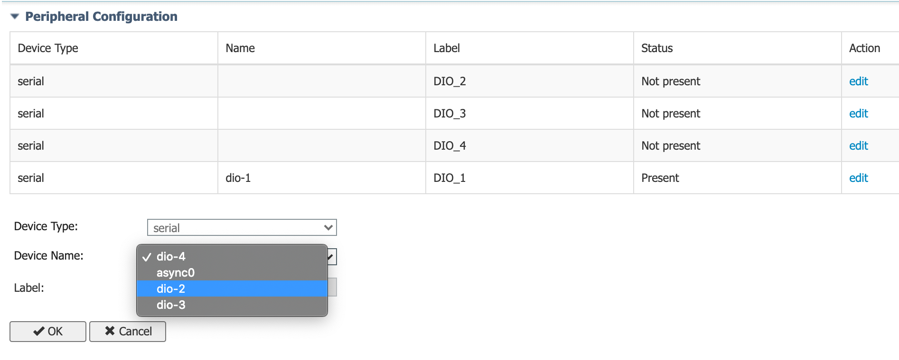

# Introduction

Cisco [Industrial Router IR1101](https://www.cisco.com/c/en/us/td/docs/routers/access/1101/b_IR1101HIG/b_IR1101HIG_chapter_01.html) is a classic Cisco router, running [Cisco IOS-XE](https://www.cisco.com/c/en/us/products/ios-nx-os-software/ios-xe/index.html), and packaged as a rugged platform for industrial applications.

The Cisco IR1101 is fanless, DC powered, and offer a host of options such as Single and Dual LTE connections, GPS with external antenna, SSD hard disk for storing IOx applications, Digital IO ports, and more.

This project will leverage the Digital IO (or DIO) interface that is present on the SPMI module extension to tun on and off each of the 4 channel output. You can for example turn on lights, appliances, cooling, or any other equipment remotely from the Cisco IR1101.

There is a single Alarm port on the IR1101 chassis, but this is input only and therefore cannot be used to this purpose. If you are interested to read the port status (for example to detect if a door is open, or is a water level is too high) check [this other project on GitHub](https://github.com/etychon/iox-ir1101-dio-read).

For this project a Docker container will be build to control those four DIO channels, and we will be using using:
- Apache as the primary Web Server,
- a small PHP7 script to trigger outputs with a shell command,
- four nice toggle buttons with jQuery,
- Ajax will be used to call the PHP script (on the server side) from the jQuery interface (running javascript on the client side)

# Prerequisites

* You'll need a Cisco IR1101 with IRM-1100-SPMI expansion module.

* The IR1101 must be configured for IOx to work properly, that is having [basic network connectivity](https://www.cisco.com/c/en/us/td/docs/routers/access/1101/software/configuration/guide/b_IR1101config/b_IR1101config_chapter_011.html) and [IOx enabled](https://www.cisco.com/c/en/us/td/docs/routers/access/1101/software/configuration/guide/b_IR1101config/b_IR1101config_chapter_010001.html). Sometimes you will see 'Application Hosting' and 'IOx' names being used for the exact same feature.

* The SPMI port is shown below and must be connected [according to the documentation](https://www.cisco.com/c/en/us/td/docs/routers/access/1101/b_IR1101HIG/b_IR1101HIG_chapter_01.html#con_1232292). Pin number 5 on the right is the signal reference (typically positive) that will be send to individial ports when they are in high (1) state, otherwise the state is ground (0).
 
Because that state is triggered by a transistor and not a relay, only small charges can be controlled and if there is a need a larger load you have to use a relay/solenoid. As an example for this project we have used a [cheap yet very efficient relay board](http://wiki.sunfounder.cc/index.php?title=4_Channel_5V_Relay_Module) from Sunfounder, Kuman, or other clones.

* Docker tooling installed on your developer machine. We have used a CentOS 8 Linux developer machine for this module, but anything else will be fine as long as you can use it.

* `ioxclient` tooling installed on your developer machine, which [can be downloaded from here](https://developer.cisco.com/docs/iox/#!iox-resource-downloads).

# Project Content

This project contains all you need to get started and build this IOx application, but if you are really impatient you can download the IOx application [straight from the Releases section](https://github.com/etychon/iox-ir1101-dio-write-web/releases/).

Here is an overview of the project content:

```
.
├── build.sh
├── Dockerfile
├── LICENSE
├── package.yaml
├── public-html
│   ├── external
│   │   └── jquery
│   │       └── jquery.js
│   ├── index.php
│   ├── lc_switch.css
│   ├── lc_switch.js
│   └── update.php
├── README.md
└── start.sh
```

## `Dockerfile`

The Dockerfile describes how to build the Docker image that will eventually be the container running on Cisco IR1101. It is composed of multiple sections as explained below.

This tells to pull [QEMU](https://www.qemu.org/) from a dedicated `qemu-user-static` repository from [Docker Hub](https://hub.docker.com/). We do this because IR1101 runs on ARM CPU, this allows to build ARM-based image when your build machine is x86-based which is most likely the case:

```
FROM multiarch/qemu-user-static:x86_64-aarch64 as qemu
[..and later..]
COPY --from=qemu /usr/bin/qemu-aarch64-static /usr/bin
```

For the sake of having a relatively small running container we will build from the ARM version of [Alpine Linux](https://alpinelinux.org/) that will also be pulled from Docker Hub:

```
FROM arm64v8/alpine
```

When the container starts, we will execute `start.sh` wrapper script to set permissions right before starting the Apache web server.

```
COPY start.sh /start.sh
```

Now we are installing Apache and PHP7 on this Alpine image:

```
# Setup apache and php
RUN apk update && apk upgrade && apk --no-cache add \
        apache2 \
        php7-apache2 \
        php7-json
```

Some configuration changes will need to be done in Apache configuration file. To do this we are using `sed` to make changed directly on the configuration file in `/etc/apache2/httpd.conf`:

```
RUN sed -i "s/#LoadModule\ rewrite_module/LoadModule\ rewrite_module/" /etc/apache2/httpd.conf \
    && sed -i "s/#LoadModule\ session_module/LoadModule\ session_module/" /etc/apache2/httpd.conf \
    && sed -i "s/#LoadModule\ session_cookie_module/LoadModule\ session_cookie_module/" /etc/apache2/httpd.conf \
    && sed -i "s/#LoadModule\ session_crypto_module/LoadModule\ session_crypto_module/" /etc/apache2/httpd.conf \
    && sed -i "s/#LoadModule\ deflate_module/LoadModule\ deflate_module/" /etc/apache2/httpd.conf \
    && sed -i "s#^DocumentRoot \".*#DocumentRoot \"/app/public\"#g" /etc/apache2/httpd.conf \
    && sed -i "s#/var/www/localhost/htdocs#/app/public#" /etc/apache2/httpd.conf \
    && sed -i "s#^Listen 80#Listen 8080#" /etc/apache2/httpd.conf \
    && printf "\n<Directory \"/app/public\">\n\tAllowOverride All\n</Directory>\n" >> /etc/apache2/httpd.conf
```

Now we are creating the main directory to host our html and php files and set the permissions right as Apache will run as `apache` user and not `root`:
```
RUN mkdir /app && mkdir /app/public && chown -R apache:apache /app && chmod -R 755 /app && mkdir bootstrap && adduser apache root
```

Now let's copy the file content for our webserver in the newly created directory:
```
COPY ./public-html/ /app/public/
```

The port number that Apache will use has been configured earlier to be 8080, so we also need to expose that port number outside to allow incoming TCP connections to Apache:

```
EXPOSE 8080
```

Lastly we will start everything at runtime by executing the `start.sh` script as below. Always remember that in Docker, the container stops when the commands stop, so this script must not exit until you want the container to stop.

```
CMD [ "sh", "/start.sh" ]
```

That's it for the Dockerfile, you can see the complete file [in the repository](https://github.com/etychon/iox-ir1101-dio-write-web/blob/master/Dockerfile).

## `start.sh`

This script runs when the container starts and contains a couple of important steps. You could start Apache directly but the Digital IO are char devices presented under `/dev/dio-*` and by default are owned by the `root` user. Because Apache will run as `apache` user it will not be able to use those devices if we do not change the permissions.

In `start.sh` let's start by changing the permission of the devices:

```
/bin/chmod a+rw /dev/dio-*
```

And then one can start Apache (you can drop the `-e debug` of course, we are just toying around here):

```
/usr/sbin/httpd -D FOREGROUND -e debug
```

That's it for the start.sh script. We are now sure that the DIO devices are writable by the `apache` user.

## `package.yaml`

## `build.sh`

To help you build the IOx application I have bundled the two build commands in `build.sh`.

* First we need to build the Docker image, this will use the Dockerfile to pull the content, copy the content to the local image repository. The command is:

```
docker build -t iox-ir1101-dio-write-web .
```

* Second we are building the IOx application based of the Docker image built on the previous step. This is leveraging the command `ioxclient` which must be installed according to the project prerequisities. The command to build the IOx application is:

```
ioxclient docker package iox-ir1101-dio-write-web . --use-targz --name iox-ir1101-dio-write-web
```

# Building the project

Clone the repository:

```
git clone https://github.com/etychon/iox-ir1101-dio-write-web.git
cd iox-ir1101-dio-write-web
```

Build the Docker image and IOx applications:

```
sh ./buid.sh
```

You should now have a file in your current directory called `iox-ir1101-dio-write-web.tar.gz` which is your IOx application.

# Router Configuration

A couple of point of additional attention are required for thie application to work.

## Check IP address

Since the application will need to be reached from outside the IR1101, you need to configure a static NAT rules on IR1101.

Configuration of the VPG0 interface that goes from IR1101 to IOx applications:

```
interface VirtualPortGroup0
 ip address 192.168.1.1 255.255.255.0
```

To make this configuration easier I recomend to use a static IP address for your IOx application, in this case we will use `192.168.1.5` for IOx as we have `192.168.1.1` for VPG0.

## NAT

Assuming the default interface on the IR1101 is GigabitEthernet0/0/0 we will expose port 2222 of that interface to our container's port 8080 (because that's the port number we had running per the image configuration) and configure the NAT inside and outside directions like so:

```
ip nat inside source static tcp 192.168.1.5 8080 interface GigabitEthernet0/0/0 2222

interface GigabitEthernet0/0/0
  ip nat outside

interface VirtualPortGroup0
  ip nat inside
```

## Expose Digital IO to IOx

By default Digital IO ports are being used by IOS-XE and not accesible to Cisco IOx. To change that the ports will need to be exposed to IOx using this CLI configuration command in IOS-XE:

```
alarm contact attach-to-iox
```

# Deploy the application

IOx applications can be deployed on the Cisco IR1101, or any Cisco IOx platform, using for examle Cisco IOx Local Manager or `ioxclient`.

For instructions on Local Manager please check [Cisco IOx Local Manager Workflows](https://www.cisco.com/c/en/us/td/docs/routers/access/800/software/guides/iox/lm/reference-guide/1-9/b_iox_lm_ref_guide_1_9/b_iox_lm_ref_guide_1_9_chapter_010.html) on Cisco.com.

When the IOx application is being deployed remeber to select a static IP address in the VPG0 range, such as `192.168.1.5` with the default gateway pointing to VPG0 IP address:


During the activation you also need to assign each Digital IO (dio-1, dio-2,...) to this application peripherals during the activation phase.



This may seems like a waste of time but remember that one can have an IOx application having access to one single DIO port, and then you can choose which port is linked to what application.

You can then activate and start the application.

# Accessing the IOx application

Based on our configuration your brower needs to point to your IR1101's GigabitEthernet0/0/0 IP address and port number 2222. In my case this is http://192.168.2.101:2222/ like so:


